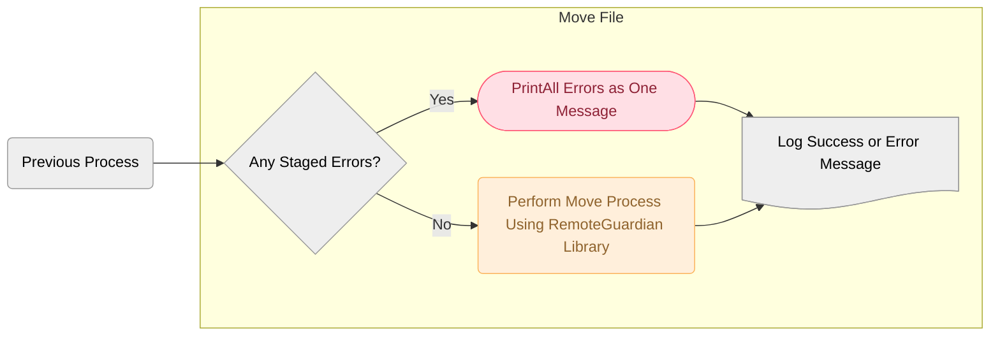

# Basic use case
<!-- intellij plugins are unable to support latest mermaid markdown -->
### Overview

```mermaid
flowchart LR
    n1(["Move Command<br>"]) --> n7["File Analysis<br>"]
    n8["Move file<br>"] --> n17["log info level details to log file"]
    n7 --> n12["Directory Analysis?"] & n18["Stage Error Message"]
    n12 --> n8 & n18
    n16(["Print all error messages<br>"]) --> n17
    n18 --> n16
    n7@{ shape: procs}
    n8@{ shape: div-proc}
    n17@{ shape: doc}
    n12@{ shape: procs}
    n18@{ shape: delay}
     n1:::Aqua
     n7:::Ash
     n8:::Pine
     n8:::Ash
     n17:::Sky
     n12:::Ash
     n18:::Ash
     n16:::Rose
    classDef redNode fill:#D50000,color:#000000
    classDef pinkNode fill:#E1BEE7,color:#000000
    classDef yellowNode fill:#FFF9C4,color:#000000
    classDef blackNode fill:#000000,stroke:#FFD600,stroke-width:4px,stroke-dasharray: 0,color:#FFFFFF
    classDef greenNode fill:#00F840,color:#000000
    classDef reminderNode stroke:#FFD600,stroke-width:4px,stroke-dasharray: 0,fill:#000000,color:#FFFFFF
    classDef blueSubgraph fill:#BBDEFB
    classDef Aqua stroke-width:1px, stroke-dasharray:none, stroke:#46EDC8, fill:#DEFFF8, color:#378E7A
    classDef Pine stroke-width:1px, stroke-dasharray:none, stroke:#254336, fill:#27654A, color:#FFFFFF
    classDef Rose stroke-width:1px, stroke-dasharray:none, stroke:#FF5978, fill:#FFDFE5, color:#8E2236
    classDef Sky stroke-width:1px, stroke-dasharray:none, stroke:#374D7C, fill:#E2EBFF, color:#374D7C
    classDef Ash stroke-width:1px, stroke-dasharray:none, stroke:#999999, fill:#EEEEEE, color:#000000

```

### File Analysis

```mermaid
flowchart LR
 subgraph s1["File Analysis"]
        n1["File Exists?"]
        n2["User Has Adequate Permissions to File?"]
        n3["File is Free From Other Processes?"]
        n4["Stage Error Prompt<br>"]
      end
    n1 -- Yes --> n2
    n2 -- Yes --> n3
    n2 -- "<span style=padding-left:><span style=padding-left:>Stage R</span></span><span style=padding-left:>eport User has Inadequate Permissions.</span>" --> n4
    n1 -- "<span style=padding-left:><span style=padding-left:>Stage </span></span><span style=padding-left:>Report File Doesn't Exist</span>" --> n4
    n3 -- "<span style=padding-left:><span style=padding-left:>Stage </span></span><span style=padding-left:>Report file is being used by another process (not reference to process using file)</span>" --> n4
    n3 --> n5["Next Process<br>"]
    n1@{ shape: decision}
    n2@{ shape: decision}
    n3@{ shape: decision}
    n4@{ shape: event}
    n5@{ shape: event}
     n1:::Ash
     n2:::Ash
     n3:::Ash
     n4:::Sky
     n4:::Peach
     n4:::Rose
     n5:::Peach
    classDef Ash stroke-width:1px, stroke-dasharray:none, stroke:#999999, fill:#EEEEEE, color:#000000
    classDef Sky stroke-width:1px, stroke-dasharray:none, stroke:#374D7C, fill:#E2EBFF, color:#374D7C
    classDef Rose stroke-width:1px, stroke-dasharray:none, stroke:#FF5978, fill:#FFDFE5, color:#8E2236
    classDef Peach stroke-width:1px, stroke-dasharray:none, stroke:#FBB35A, fill:#FFEFDB, color:#8F632D
    style n4 fill:#424242
    style s1 stroke:#2962FF
```

### Directory Analysis

```mermaid
flowchart LR
 subgraph s1["Directory Analysis"]
        n1["Directory Exists?"]
        n2["User Has Adequate Permissions to Directory?"]
        n4["Stage Error Prompt<br>"]
  end
    n1 -- Yes --> n2
    n2 -- "<span style=padding-left:><span style=padding-left:>Stage R</span></span><span style=padding-left:>eport User has Inadequate Permissions.</span>" --> n4
    n1 -- "<span style=padding-left:><span style=padding-left:>Stage </span></span><span style=padding-left:>Report File Doesn't Exist</span>" --> n4
    n2 -- Yes --> n5["Next Process<br>"]
    n4 --> n5
    n1@{ shape: decision}
    n2@{ shape: decision}
    n4@{ shape: event}
    n5@{ shape: event}
     n1:::Ash
     n2:::Ash
     n4:::Sky
     n4:::Peach
     n4:::Rose
     n5:::Peach
    classDef Ash stroke-width:1px, stroke-dasharray:none, stroke:#999999, fill:#EEEEEE, color:#000000
    classDef Sky stroke-width:1px, stroke-dasharray:none, stroke:#374D7C, fill:#E2EBFF, color:#374D7C
    classDef Rose stroke-width:1px, stroke-dasharray:none, stroke:#FF5978, fill:#FFDFE5, color:#8E2236
    classDef Peach stroke-width:1px, stroke-dasharray:none, stroke:#FBB35A, fill:#FFEFDB, color:#8F632D
    style n4 fill:#424242
    style s1 stroke:#2962FF
```

### Move File

```mermaid
flowchart LR
 subgraph s1["Move File"]
        n4["Any Staged Errors?<br>"]
        n5["PrintAll Errors as One Message<br>"]
        n6["Log Success or Error Message<br>"]
        n7["Perform Move Process Using RemoteGuardian Library<br>"]
  end
    n3["Previous Process<br>"] --> n4
    n4 -- Yes --> n5
    n5 --> n6
    n4 -- No --> n7
    n7 --> n6
    n4@{ shape: decision}
    n5@{ shape: terminal}
    n6@{ shape: doc}
    n7@{ shape: event}
    n3@{ shape: event}
     n4:::Ash
     n5:::Rose
     n6:::Ash
     n7:::Peach
     n3:::Ash
    classDef Rose stroke-width:1px, stroke-dasharray:none, stroke:#FF5978, fill:#FFDFE5, color:#8E2236
    classDef Peach stroke-width:1px, stroke-dasharray:none, stroke:#FBB35A, fill:#FFEFDB, color:#8F632D
    classDef Ash stroke-width:1px, stroke-dasharray:none, stroke:#999999, fill:#EEEEEE, color:#000000
```