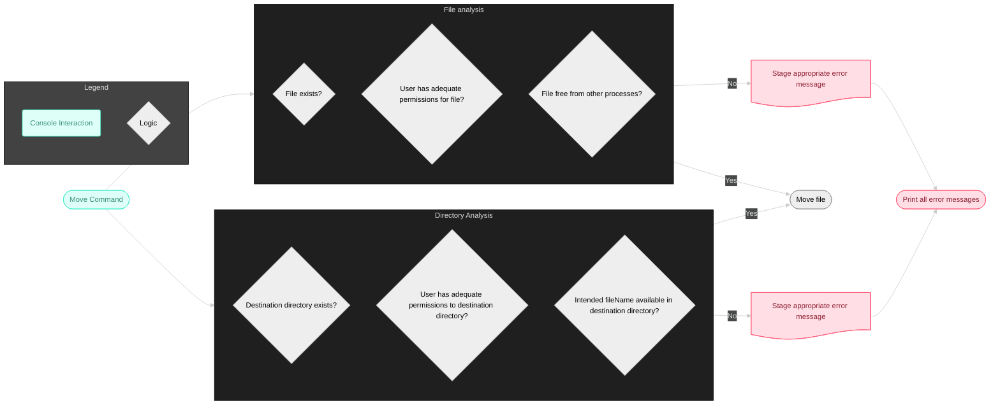

# Basic use case
<!-- intellij plugins are unable to support latest mermaid markdown -->

```mermaid
---
config:
  theme: neo-dark
  layout: fixed
---
flowchart LR
 subgraph subgraph_zv2q8ucnp["Legend"]
        n3["Console Interaction<br>"]
        n4["Logic"]
  end
 subgraph s1["File analysis"]
        n5["File exists?<br>"]
        n6["User has adequate permissions for file?<br>"]
        n7["File free from other processes?<br>"]
  end
 subgraph s2["Directory Analysis"]
        n12["Destination directory exists?<br>"]
        n13["User has adequate permissions to destination directory?<br>"]
        n14["Intended fileName available in destination directory?<br>"]
  end
    n1(["Move Command<br>"]) --> s1 & s2
    s1 -- No --> n9["Stage appropriate error message<br>"]
    s1 -- Yes --> n8(["Move file<br>"])
    s2 -- Yes --> n8
    s2 -- No --> n15["Stage appropriate error message<br>"]
    n15 --> n16(["Print all error messages<br>"])
    n9 --> n16
    n3@{ shape: rounded}
    n4@{ shape: diam}
    n5@{ shape: diam}
    n6@{ shape: diam}
    n7@{ shape: diam}
    n12@{ shape: diam}
    n13@{ shape: diam}
    n14@{ shape: diam}
    n9@{ shape: doc}
    n15@{ shape: doc}
     n3:::Aqua
     n4:::Ash
     n5:::Ash
     n6:::Ash
     n7:::Ash
     n12:::Ash
     n13:::Ash
     n14:::Ash
     n1:::Aqua
     n9:::Rose
     n8:::Pine
     n8:::Ash
     n15:::Rose
     n16:::Rose
    classDef redNode fill:#D50000,color:#000000
    classDef pinkNode fill:#E1BEE7,color:#000000
    classDef yellowNode fill:#FFF9C4,color:#000000
    classDef blackNode fill:#000000,stroke:#FFD600,stroke-width:4px,stroke-dasharray: 0,color:#FFFFFF
    classDef greenNode fill:#00F840,color:#000000
    classDef reminderNode stroke:#FFD600,stroke-width:4px,stroke-dasharray: 0,fill:#000000,color:#FFFFFF
    classDef blueSubgraph fill:#BBDEFB
    classDef Aqua stroke-width:1px, stroke-dasharray:none, stroke:#46EDC8, fill:#DEFFF8, color:#378E7A
    classDef Pine stroke-width:1px, stroke-dasharray:none, stroke:#254336, fill:#27654A, color:#FFFFFF
    classDef Ash stroke-width:1px, stroke-dasharray:none, stroke:#999999, fill:#EEEEEE, color:#000000
    classDef Rose stroke-width:1px, stroke-dasharray:none, stroke:#FF5978, fill:#FFDFE5, color:#8E2236
    style s1 stroke:#000000
    style s2 stroke:#000000
    style subgraph_zv2q8ucnp fill:#424242,stroke:#000000
```