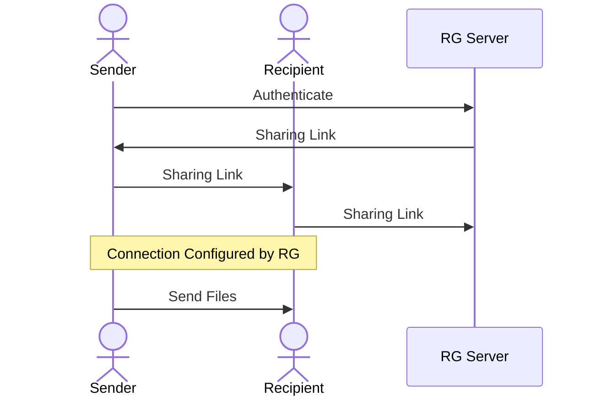
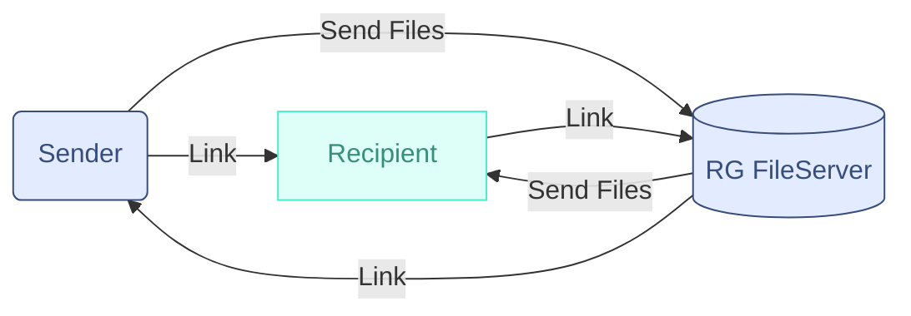

# Peer to Peer 

### No Middleman Server

```mermaid
sequenceDiagram
  actor Sender
  actor Recipient
  participant RG Server
  Sender ->> RG Server: Authenticate
  RG Server ->> Sender: Sharing Link
  Sender ->> Recipient: Sharing Link
  Recipient ->> RG Server: Sharing Link
  Note over Sender, Recipient: Connection Configured by RG
  Sender ->> Recipient: Send Files
```
### RemoteGuardian File Server

```mermaid
flowchart LR
    n1["Sender"] -- Link --> n2["Recipient"]
    n1 -- Send Files --> n4["RG FileServer<br>"]
    n4 -- Send Files --> n2
    n4 -- Link --> n1
    n2 -- Link --> n4
    n1@{ shape: rounded}
    n4@{ shape: cyl}
     n1:::Aqua
     n1:::Ash
     n1:::Sky
     n2:::Sky
     n2:::Aqua
     n4:::Sky
    classDef Aqua stroke-width:1px, stroke-dasharray:none, stroke:#46EDC8, fill:#DEFFF8, color:#378E7A
    classDef Ash stroke-width:1px, stroke-dasharray:none, stroke:#999999, fill:#EEEEEE, color:#000000
    classDef Sky stroke-width:1px, stroke-dasharray:none, stroke:#374D7C, fill:#E2EBFF, color:#374D7C
```