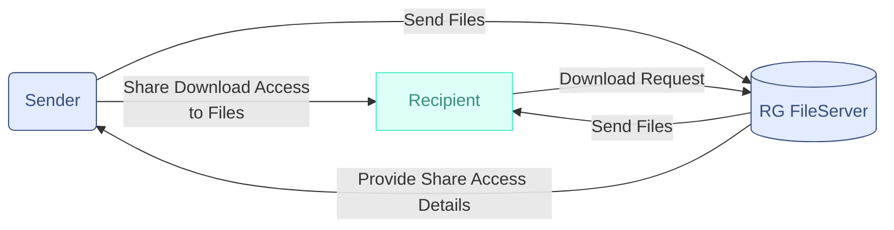

# Proposal High Level Overview

## RemoteGuardian Fileserver

White label a cloud storage provider using [Micronaut Object Storage](https://micronaut-projects.github.io/micronaut-object-storage/latest/guide/). I'd suggest [Oracle](https://guides.micronaut.io/latest/micronaut-object-storage-oracle-cloud.html) over [Amazon](https://guides.micronaut.io/latest/micronaut-object-storage-aws.html), Azure, or [Google Cloud](https://guides.micronaut.io/latest/micronaut-object-storage-gcp.html), but all four are options that Micronaut supports out of the box. 

- Oracle is the underlying author of much of the technologies that we use, like Micronaut and the GraalVM. Using Oracle's cloud offering may offer performance opportunities with the graalvm that other cloud providers can't offer. This is me guessing and we'd want to talk to someone who knows all vendors AND who knows GraalVM tech to be able to answer this. I can read into it if we want
- Storage is encrypted by default

> Note: cloud implementations can be tested locally using [micronaut's local storage configuration](https://micronaut-projects.github.io/micronaut-object-storage/latest/guide/#local) to save on costs during development

## Send & Receive Files
This underlying tech can be done with Micronaut's object storage as well. If we pair this with Micronaut Security and Keycloak. I think this can be done by combining these tech, but I'd need to read into it to provide a proof of concept. 

## Recipient Authentication Strategies when Sharing Access
From what I recall, ease on the part of the recipient is a priority in this use case. ie if the recipient only needs a link to access and download the files, that would be an example of ease of use on that part.

### Proposed Strategies

<ul><li>

#### Link provided to recipient contains all authentication needed

ie `https://vanity-url`/`location`/`access-key`
 
Access key could be a generated token bespoke for this sharing need. 

<li>

#### LDAP Authentication
Recipients create a free account and then login to access files even if they're just downloading some documents. 

<li> 

#### Username and token combo
Recipients are given a unique username and an access token to use in place of a password to gain access to shared content. Similar to Ldap auth but short lived and both the username and password are generated and not meaningful. 

